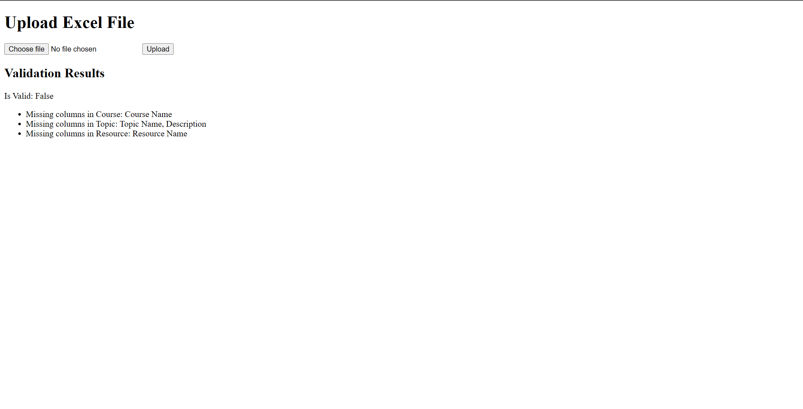
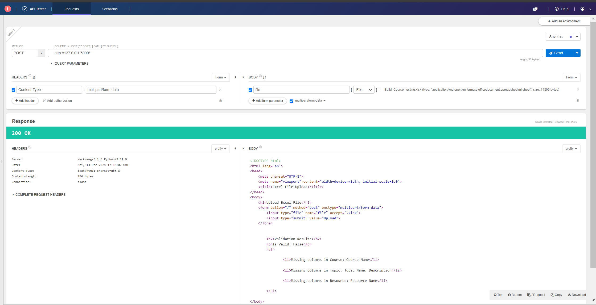

# Flask Excel File Upload and Validation

A simple Flask web application for uploading and validating Excel files. It checks for required sheets and columns, and displays validation results on the same page.




## Features   

- Upload excel file (.xlsx)
- Validate required sheets and columns
- Display validation results

## Requirements

- Python 3.x
- Flask
- Pandas

## Installation

1. Clone the repository
2. Create and activate a virtual environment
3. Install the required packages

## Usage

1. Run the Flask application:
    ```sh
    python assgn.py
    ```
2. Open your web browser and go to `http://127.0.0.1:5000/`.
3. Upload an Excel file and view the validation results on the same page.
